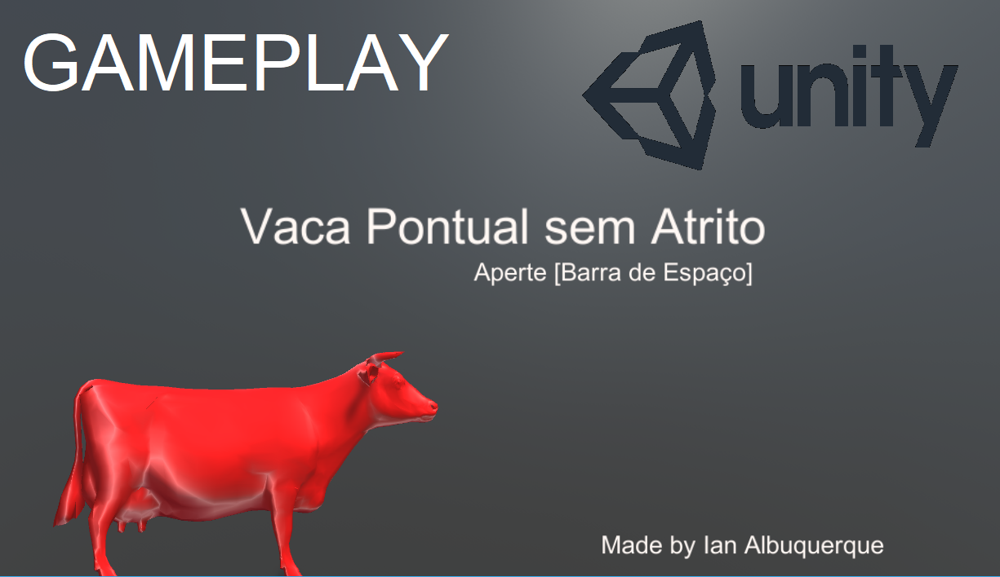

# Vaca Pontual "Hello World" Unity Game

Game developed as a "Hello World" example as part of the froup RPG - Rio PUC Games


[MIT LIcensed](LICENSE.md)

## Game Download

[http://ianalbuquerque.com/downloads/Ian_Albuquerque_Vaca_Pontual.zip](http://ianalbuquerque.com/downloads/Ian_Albuquerque_Vaca_Pontual.zip)

## Gameplay Footage

[](https://youtu.be/X-L5TZ0ug1w)
(Click on image to watch gameplay footage on Youtube)

----

## Assets Structure (2018-04-17)

```
/Assets
  /materials
    background_material.mat
    cow_material.mat
    ending_material.mat
    hazard-material.mat
  /models
    cow_2904.obj
  /scenes
    end_game.unity
    game_start.unity
    main_scene.unity
  /scripts
    ApplyTagsToChildren.cs
    EndGameCow.cs
    FixRotation.cs
    HazardCollision.cs
    ObjMovementSnapper.cs
    PlayerMovement.cs
    PressSpaceToChangeScene.cs
  /sound
    bgm.ceol
    bgm.wav
    boi.wav
    mu_01.wav
    perdi.wav
    vaca.wav

```

## Assets References

- cow_2904.obj 3D model obtained in [https://projet.liris.cnrs.fr/meshben/](https://projet.liris.cnrs.fr/meshben/)
- all other assets were made by Ian Albuquerque
  - audio recorded with `Audacity`
  - background music made with `Bosca Ceoil`

## Game Features

  - Start Screen, Game Screen and End Screen
    - implemented via unity scenes, with scripts `PressSpaceToChangeScene.cs` and `EndGameCow.cs` to change between them.
  - WASD Movement (`PlayerMovement.cs`)
  - Spacebar (Double) Jump (`PlayerMovement.cs`)
  - Cow Model Snapping in 90 degrees quantization

    

## Development Questions

Documentation and Code Organization
- What is a good naming convention for scripts? Variables? Functions>
  - Currently using: `ThisIsMyScriptName.cs` for files and `CamelCase` for code.

- Any methods documentation patterns?
  - Currently using: `none`
  
- In Unity, you attach scripts as components of Game Objects. In order to reference another component of that same Game Object (for example, a `RigidBody`) you could put it as a public member or, as an alternative, you could use functions such as `GetComponent<Rigidbody>()`. 

  - The problem with the second approach is documentation and component dependency, since you are making your script in a way that it REQUIRES to be placed in a Game Object that contains a `RigidBody` for instance.

  - The first approach, however, has the downside of increasing the number of external variables, which is already usually big. Also, if you are making all input variables public, what is the point of attaching it to specific Game Objects such as player/camera/etc, instead of attaching all scripts to a single Game Object in the root of the scene structure?

- Obviously, naming the objects in scene is important. However, some parts of the scene structures may be composed of multiple objects. In my example, I have for the main level floors wall and background the following hierarchy:

  ```
    World
      Cube
      Cube (1)
      Cube (2)
      Cube (4)
      cow_2904
      Point light
      Plane
      cow_2904 (1)
      Plane (1)
      Point light (1)
      ....
  ```

  Those are not good names for sure, but all those objects inside `World` are only parts of the floor/background and do not have any scripts / function associated to them. Do they really need better names?

- Where is the preferred place in the Unity Scene to add non-3D audio effects? I have added `Audio Source` components to the main player, but I am not sure how I would do to add multiple `Audio Source`s to the same object. Should I add them to an object associated to the main game camera? What if there are multiple game cameras?

Content Production

  - For instance, if I make an asset in an external software (in my case, `Busca Ceoil`) (Photoshop would be another good example) where would I save the original file format? (For instance, the `.ceol` or `.psd`)
    - Currently saving in the same file as the exported format

  - Constantly I found myself accidentally editing the scene with the `Play Mode` activated in Unity. When I exited `Play Mode` all my changes did not persist. (I can see why it is implemented that way, but it really hurt my productivity). Any comments regarding this?

Unity Game Engine

  - Do button press events really need to be checked unside the `Update` loop? Isnt there any event trigger that can be configured within Unity?

  - I have noted on my jump routine that my attempt to reset the player's `RigidBody` velocity is not working with the code below:

    ``` csharp
      void Update () {
        // ...
        if (Input.GetKeyDown("space")) {
          // ...
          this.collisionSphereRigidBody.velocity.Set(0.0f, 0.0f, 0.0f);
          this.collisionSphereRigidBody.AddForce( 0.0f,
                                                  1.0f * this.jumpAccelerationMultiplier,
                                                  0.0f,
                                                  ForceMode.Impulse);
          /// ...
        }
      }
    ```

    Did I miss something from the Unity way of handling physics?

  - I am currently tagging the world objects as `floor` to use that in my collision script. Since the object floor is composed of many sub-parts, I only added the `floor` tag to the parent and made a script to propagate the tag to all children of the hierarchy. Is that a good way to do it or is there a standard method for that?

  - How do objects that have `RigidBody` attached to them work with the scene hierarchy. During a moment in the development, I added a rigid body to the cow model, which was a child of the collision sphere that had also a `RigidBody` attached to it. This setup was conflicting and both `RigidBody`s reacted weirdly with the engine by colliding with themselves, causing unexpected camera movements.

  - Is there any way to find in which Game Objects a script has been used as a component?

Optimization

  - What is more expensive? Creating a new Unity scene for making the initial game menu, or using a separated part of the main scene to do it? What is the efficiency / code management tradeoff?

  - How do I detect performance bottlenecks? For instance, my cow 3D mesh has 2904 triangle faces and are instanced several times for the scene rendering. How will I know if I am reaching a performance issue?

## Game Design Analysis

Level Design
  - The idea was to divide the game level into 4 parts:

    - Jump Mechanic: Jump and Double Jump
      - Jump by going over small block
      - Double jump by going over big block
    - Sliding Mechanics: There is no drag on the floor. Hence, climbing ramps is not trivial.
      - Ramp going up to show how hard it is to climb up
      - Ramp going down to show how it is easy to lose control of the player
    - Death Mechanic: Colliding with the green things is bad
      - Quick respawn because it is a quick demo game
      - Location of green thing lowered from the main level of the stage added with the different color, implies that player should jump over it
      - Easy to skip? Easy to miss?
    - All Combined: Place where player uses all knowledge so far
      - Ramp with hazard nearby
      - Tight platforming
      - New application for jumping (vertical ladder)

    

Narrative Analysis

  - I tried to divide the game into the following structure:

    - Realization you are a cow (with the "vaca" sound effect on jump)
      - Also, background characterization with static white cows
    - Main platform game
    - Realization you are not alone (with the "boi" sound effect at the end)
    - Ecounter with the blue cow

    

## Art & Audio Analysis

  - 3D Cow Model perhaps too complex? Could be simplified
  - Different audio levels
    - Specifically, the green hazard collision is too low
  - Audio too noisy. Better filtering? Problems on recording?
